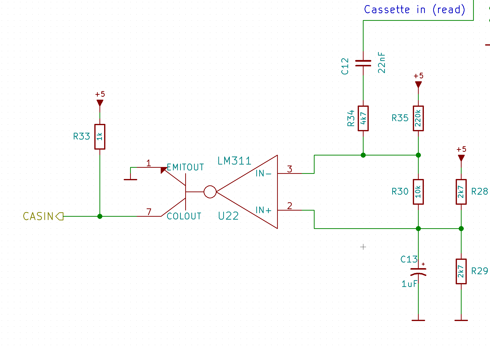

## Cassette Input & Output

As most MSX systems, Artemisa provides a interface to load and save programs and data from an audio cassette. Data is backed up at 1200 or 2400 baud with Frequency Shift Keying (FSK) in the standard "Kansas City" format.

The cassette device is connected to the MSX through a 8-pin DIN connector (DIN 45326) with the following pinout:

| Pin | Name   | Direction | Description    |
| --- | ------ | ---- | -------------- |
| 1   | GND    |      | Ground         |
| 2   | GND    |      | Ground         |
| 3   | GND    |      | Ground         |
| 4   | CMTOUT |      | Sound output   |
| 5   | CMTIN  |      | Sound input    |
| 6   | REM+   |      | Remote control |
| 7   | REM-   |      | Remote control |
| 8   | GND    |      | Ground         |

In summary, pins 4 and 5 carry the sound output and input, respectivelly. Pins 6 and 7 are used to start and stop the cassette motor. They are barely used in practice and Artemisa do not use them (these pins are grounded). The rest of pins are connected to ground.

There are two different circuits in Artemisa to generate cassette input and outputs: one that decodes `CMTIN` and another one that encodes `CMTOUT`.

## Cassette Input Decoding

The audio cassette will send an analog signal to the computer with a form of sinusoidal wave through `CMTIN`. The decoding circuit is based on a LM311 part, a voltage comparator, in order to convert the input wave into a 5V squared signal.

What LM311 does is basically open or close its open-collector output based on the voltage levels of `IN+` and `IN-` pads. If `IN+` voltage is greater than `IN-` voltage, the output transistor will not conduct. Thus, thanks to the pull-up resistor R33, the output will be 5V. If `IN+` voltage is less than `IN-` voltage, the output transistor conducts. Thus, the output will be 0 volts sin emiter is connected to ground.

In order to achieve that, the circuit have the following [voltage dividers](https://en.wikipedia.org/wiki/Voltage_divider):
* One made by `R28` and `R29` that feed `IN+`. Both resistors have the same value, so the input to `IN+` is approximately 2.5 volts. 
* One made by `R30` and `R35` on top of `IN+`, that feed `IN-`. The combination of both resistors gives approximately 2.61 volts in `IN-`. 

Since the values of resistors in `IN-` are really large, we might expect to have a very low current coming from `IN+` (<50uA). So `IN+` maintains its voltage intact. `C13` also contributes to counter act the voltage drop from `IN-`, maintaining the potential at 2.5 volts. 

In abscense of voltage coming from `CMTIN`, this circuit will ensure the voltage in `IN-` is slightly greater than `IN+`. Thus, when we receive no signal from the cassette, the digital output will be low. We would read zeroes. 

When a voltage comes from `CMTIN`, it passes through `C12` and `R34`. The capacitor removes the DC offset, and the resistor reduces the amplitude of the waveform. This is especially needed for data recorders that generate signals that exceed the 5 volts peer-to-peek (some do). The analogic signal is combined with the DC value provided by the voltage divider in `IN-`. As result, the low part of the pulse will be below 2.5v barrier. And high part of the pulse will be above it. Thus, the LM311 will generate a squared waveform in `CASIN` that matches the frequency of `CMTIN` line.

## Cassette Output Encoding

The audio cassette will expect an analog signal from the computer with a form of sinusoidal wave through `CMTOUT`. The encoding is implemented by the following RC circuit.

The capacitor C10 removes the DC bias from the output signal. The circuit formed by R25 and C11 implements a [RC integrator](https://www.electronics-tutorials.ws/rc/rc-integrator.html) that causes the input squared signal to acquire a pseudo-sinusoidal waveform. Finally, the combination of R26 and R27 acts as a voltage divider that reduces the amplitude of the signal
